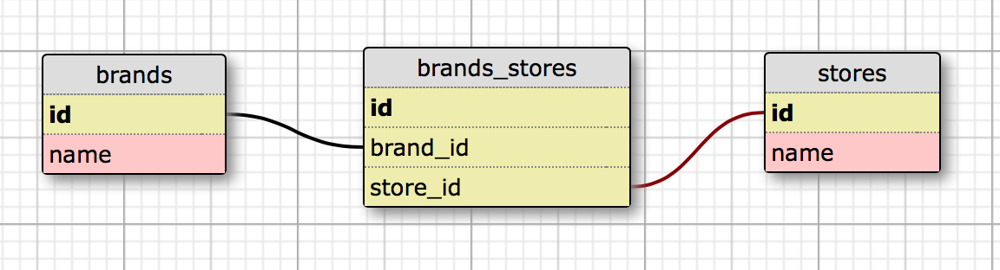

# _Shoe Distributor web app_

##### This application is a demonstration application designed to show a many-to-many relationship between employees and projects using Active Record.

## Technologies Used

Application: Ruby, Sinatra, Active Record<br>
Testing: Rspec, Capybara<br>
Database: Postgres

Installation
------------

```
$ git clone https://github.com/craigwann/shoe_distibutor.git
```

Install required gems:
```
$ bundle install
```

Create databases:
```
rake db:create
rake db:schema:load
```

Start the webserver:
```
$ ruby app.rb
```

Navigate to `localhost:4567` in browser.

Database Schema
-------



License
-------

GNU GPL v2. Copyright 2015 **Epicodus**

***Small change to README added to bookmark completion of one-to-many relationship between employees and projects***
