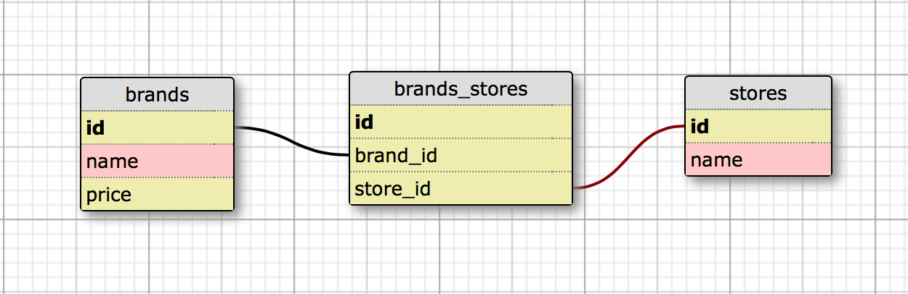

# _Shoe Distributor web app_

##### This application is a demonstration application designed to show a many-to-many relationship between employees and projects using Active Record.

## Technologies Used

<em>Application:</em> Ruby, Sinatra, Active Record<br>
<em>Testing:</em> Rspec, Capybara<br>
<em>Database:</em> Postgres

User Stories
------------
1. As a user, I want to be able to add, update, delete and list shoe stores.
1. As a user, I want to be able to add and list new shoe brands. Shoe brands should include price.
1. As a user, I want to be able to add shoe brands in the application.
1. As a user, I want to be able to add existing shoe brands to a store to show where they are sold.
1. As a user, I want to be able to associate the same brand of shoes with multiple stores.
1. As a user, I want to be able to see all of the brands a store sells on the individual store page.
1. As a user, I want store names and shoe brands to be saved with a capital letter no matter how I enter them.
1. As a user, I want the price to be in currency format even if I just inputted a number. (In other words, typing in 50 should be updated to $50.00.)
1. As a user, I do not want stores and/or shoe brands to be saved if I enter a blank name.
1. As a user, I want all stores and brands to be unique. There shouldn't be two entries in the database for Blundstone.
1. As a user, I want store and brand names to have a maximum of one hundred characters.

Installation
------------

```
$ git clone https://github.com/craigwann/shoe_distibutor.git
```

Install required gems:
```
$ bundle install
```

Create databases:
```
rake db:create
rake db:schema:load
```

Start the webserver:
```
$ ruby app.rb
```

Navigate to `localhost:4567` in browser.

Database Schema
-------



License
-------

GNU GPL v2. Copyright 2015 **Epicodus**

***Small change to README added to bookmark completion of many-to-many relationship between brands and stores***
